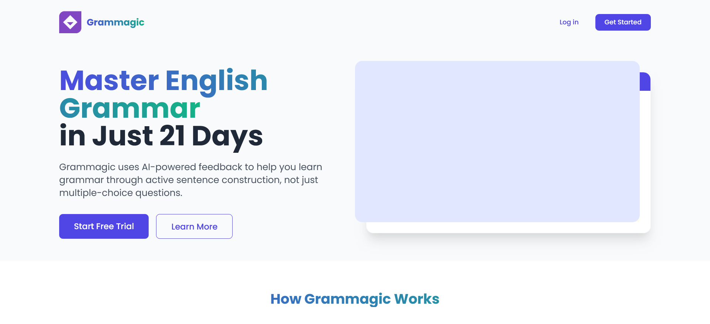
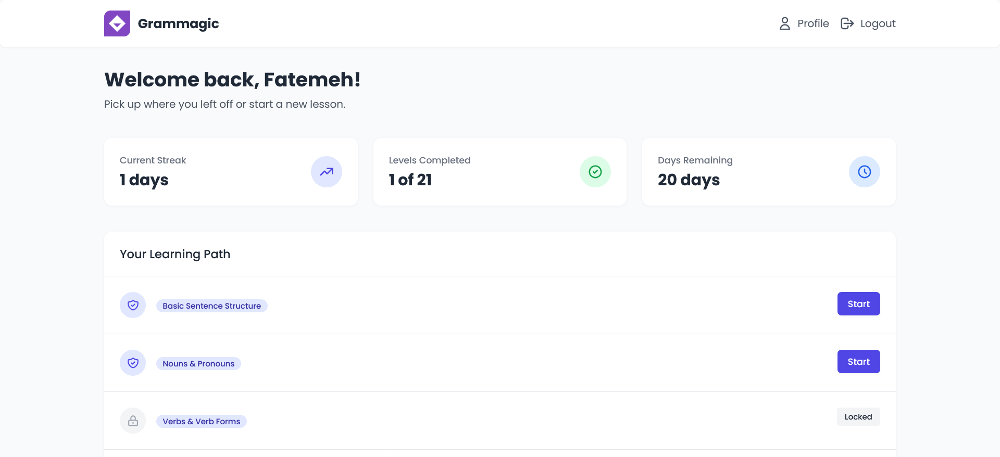
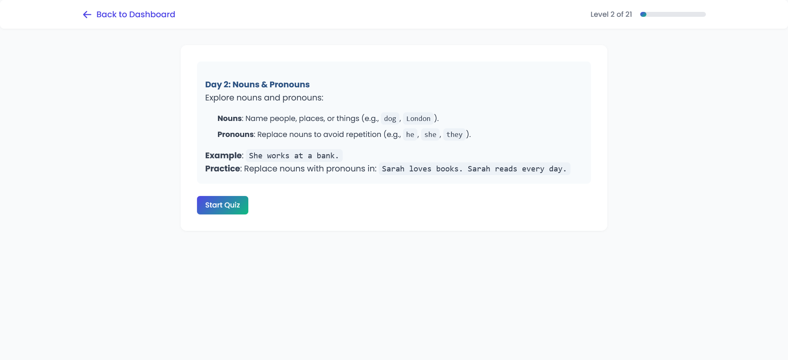
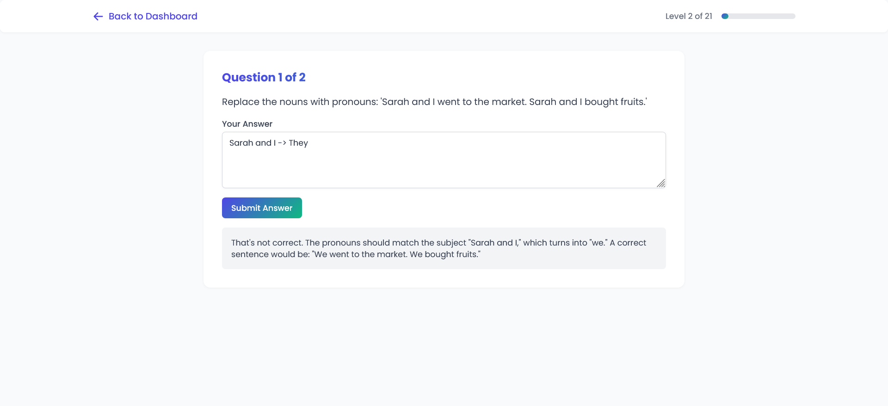

# Grammagic – AI-powered English Grammar Tutor

Grammagic is an interactive web application that helps users master essential English grammar over a 21-day learning plan. Built using Laravel, Livewire, and Tailwind CSS, it features daily lessons, AI-evaluated quizzes, gamified progress tracking, and a clean, responsive UI.

---

## Project Overview

Grammagic focuses on learning by doing. Each day, learners read structured lessons (in Markdown format), attempt open-ended questions, and get instant feedback powered by OpenAI's GPT-4o-mini. The application is lightweight, fast, and built for both desktop and mobile.

---

## Technologies Used

[](https://laravel.com)
[](https://laravel-livewire.com)
[](https://tailwindcss.com)
[](https://openai.com)
[](https://sqlite.org)

---

## Features

- **21-Day Grammar Journey**: Covers fundamental English grammar topics with increasing difficulty
- **AI-Powered Feedback**: Evaluates student-written sentences and gives tailored feedback using GPT-4o-mini
- **Gamified Streak Tracking**: Encourages consistent daily learning through streak monitoring
- **Progressive Unlocking**: New grammar levels unlock only after completing previous ones

---

## Screenshots

All screenshots can be found in the [`screenshots`](./screenshots) folder:

|  |  |
|-----------------------------------------|-------------------------------------------|
|  |            |

---

## Getting Started

```bash
# 1. Clone the repository
git clone https://github.com/fatemeh-shahrabi/grammagic.git
cd grammagic

# 2. Install PHP dependencies
composer install

# 3. Install frontend dependencies
npm install && npm run build

# 4. Set up environment
cp .env.example .env
php artisan key:generate

# 5. Create SQLite DB
touch database/database.sqlite

# 6. Update .env
DB_CONNECTION=sqlite
DB_DATABASE=/absolute/path/to/database/database.sqlite
OPENAI_API_KEY=your-openai-key

# 7. Run migrations and seed data
php artisan migrate --seed

# 8. Start development server
php artisan serve
```
```

Environment Variables

Make sure to add your OpenAI API key in the .env file

```env
OPENAI_API_KEY="your_openai_api_key_here"
```
---

## Usage Guide

- Register/Login to begin your learning journey
- Choose a lesson (Day 1–21) to access its content
- Read the Markdown lesson, then start the quiz
- Submit open-ended answers and receive GPT-evaluated feedback
- Track your streak and progress on the dashboard

---

## Acknowledgments

Created as a Rubikamp AI project
Powered by OpenAI's GPT-4o-mini
Inspired by apps like Duolingo


